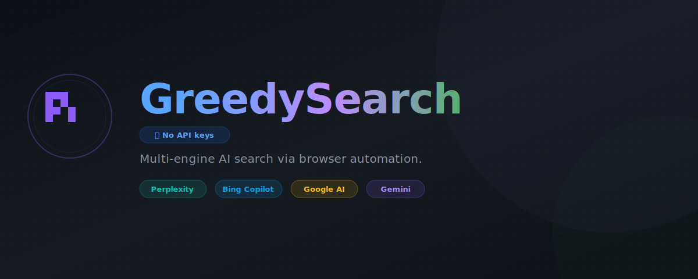

# GreedySearch for Pi



Multi-engine AI web search for Pi via browser automation.

- No API keys
- Real browser results from configurable engines: Perplexity, Google AI, ChatGPT, Gemini, plus opt-in Semantic Scholar and Logically research engines
- Research mode as the centerpiece: iterative planning, source fetching, citation audit, and structured bundles
- Optional configurable synthesis with source grounding (Gemini by default)
- Chrome runs headless by default — no window, purely background

## Install

```bash
pi install npm:@apmantza/greedysearch-pi
```

Or from git:

```bash
pi install git:github.com/apmantza/GreedySearch-pi
```

## Tool

- `greedy_search` — multi-engine AI web search, source-grounded synthesis, and deep research

## Quick usage

```js
greedy_search({ query: "React 19 changes" }); // all engines + fetched sources
greedy_search({ query: "React 19 changes", synthesize: true }); // add configured synthesis
greedy_search({ query: "Prisma vs Drizzle", engine: "perplexity" }); // individual engine
greedy_search({
  query: "Evaluate browser automation options for AI agents",
  depth: "research",
  breadth: 3,
  iterations: 2,
  maxSources: 8,
});
// Research mode writes a dataroom-style bundle under .pi/greedysearch-research/ by default.
// Headless is the default — no window. To force visible Chrome:
greedy_search({ query: "Visible browser setup", engine: "perplexity", visible: true });
```

## Parameters (`greedy_search`)

### Common

- `query` (required)
- `fullAnswer`: return full single-engine output instead of preview
- `headless`: set to `false` to show Chrome window (default: `true`)
- `visible` / `alwaysVisible`: set to `true` to always use visible Chrome for this search

### Normal search

- `engine`: `all` (default web/search fan-out), `perplexity`, `google`, `chatgpt`, `gemini`; opt-in research engines: `semantic-scholar`, `logically`; `bing` still works for signed-in users
- `synthesize`: for `engine: "all"`, synthesize fetched sources with the configured synthesizer (default false)
- `synthesizer`: override the configured synthesis engine for this call (`gemini` default, `chatgpt` supported)
- `depth`: legacy `fast`/`standard`/`deep` aliases are still accepted for compatibility; prefer `synthesize` for normal search

### Deep research

- `depth`: set to `"research"` to run the iterative research workflow
- `breadth`: number of research actions per round, 1-5 (default 3)
- `iterations`: research rounds, 1-3 (default 2)
- `maxSources`: fetched source cap for the final report, 3-12
- `researchOutDir`: optional directory for the research bundle
- `writeResearchBundle`: write the research bundle to disk (default true for research mode)

Deep research uses the configured `~/.pi/greedyconfig.engines` list for child searches and Gemini for planning/final synthesis.

## Environment variables

| Variable                             | Default       | Description                                                   |
| ------------------------------------ | ------------- | ------------------------------------------------------------- |
| `GREEDY_SEARCH_VISIBLE`              | (unset)       | Set to `1` to show Chrome window instead of headless          |
| `GREEDY_SEARCH_ALWAYS_VISIBLE`       | (unset)       | Set to `1` to force visible Chrome for all GreedySearch runs  |
| `GREEDY_SEARCH_IDLE_TIMEOUT_MINUTES` | `5`           | Minutes of inactivity before auto-killing GreedySearch Chrome |
| `GREEDY_SEARCH_LOCALE`               | `en`          | Default result language (en, de, fr, es, ja, etc.)            |
| `CHROME_PATH`                        | auto-detected | Path to Chrome/Chromium executable                            |

## Search modes

- **Individual engine search/research** — `engine: "perplexity" | "google" | "chatgpt" | "gemini" | "semantic-scholar" | "logically" | "bing"`; returns that engine's answer and sources.
- **Grounded multi-engine search** — default `engine: "all"`; fans out to configured engines, ranks sources, fetches top source content, and reports confidence metadata.
- **All + synthesis** — add `synthesize: true` (or CLI `--synthesize`) to ask the configured synthesizer to combine engine answers and fetched source evidence.
- **Deep research** — `depth: "research"`; iterative action planning, direct URL fetches, fast multi-engine searches, source fetching, learning extraction, deterministic floor checks, citation audit, a final cited report, and a structured on-disk bundle.

Legacy `depth: "fast" | "standard" | "deep"` values remain accepted for compatibility: `fast` skips source fetching; `standard`/`deep` request synthesis.

Configure all-engine fan-out and synthesis in `~/.pi/greedyconfig`:

```json
{
  "engines": ["perplexity", "google", "chatgpt", "gemini", "semantic-scholar", "logically"],
  "synthesizer": "gemini"
}
```

Gemini is a normal search engine and can participate in `engine: "all"`. Semantic Scholar and Logically are opt-in research engines; include them in `~/.pi/greedyconfig` only when you want the all-engine fan-out to include academic paper discovery or research-assistant workflows. Deep research child searches reuse the same configured `engines` list and keep query text on stdin; Gemini remains the research planner/final-report synthesizer. If `synthesize: true` and `"synthesizer": "gemini"`, Gemini runs once as a search engine and again as the synthesizer; set `"synthesizer": "chatgpt"` to separate those roles for normal all-search synthesis.

Research bundles are written by default to `.pi/greedysearch-research/<timestamp>_<query>/` and include:

```text
STATUS.md              # floor status, open/closed question ledger, and gaps
OUTLINE.md             # bundle table of contents
reports/SUMMARY.md     # final cited report
reports/CLAIMS.md      # extracted claims mapped to source IDs
reports/EVIDENCE.md    # goal-based evidence extracted from fetched sources
reports/GAPS.md        # caveats and remaining uncertainties
sources/               # fetched source markdown files
data/manifest.json     # run metadata, stop reason, floor checks, citation audit
data/rounds.json       # per-round actions/learnings/gaps
data/sources.json      # ranked source registry
data/questions.json    # STATUS-style question ledger with evidence/source IDs
data/evidence.json     # structured rational/evidence/summary per useful source
```

CLI controls:

```bash
node bin/search.mjs all --inline --stdin --depth research --breadth 3 --iterations 2 --max-sources 8 <<'EOF'
Evaluate browser automation options for AI agents
EOF
node bin/search.mjs all "topic" --depth research --research-out-dir ./research-topic
node bin/search.mjs all "topic" --depth research --no-research-bundle
```

## Runtime commands

Inside Pi, prefer the extension commands (no package path needed):

```text
/greedy-visible      # launch visible Chrome for captcha/login/cookie setup
/greedy-status       # show GreedySearch Chrome status
/greedy-kill         # stop GreedySearch Chrome
/set-greedy-locale   # set default result language (de, fr, es, ja, etc.)
```

Git install path:

```bash
GS=~/.pi/agent/git/github.com/apmantza/GreedySearch-pi
node "$GS/bin/launch.mjs" --status
node "$GS/bin/visible.mjs"          # visible mode
node "$GS/bin/visible.mjs" --kill   # strong visible/port cleanup
node "$GS/bin/kill-visible.mjs"     # same as visible.mjs --kill
node "$GS/bin/cdp-visible.mjs" list # safe CDP: GreedySearch visible Chrome only
node "$GS/bin/cdp-headless.mjs" list # safe CDP: GreedySearch headless Chrome only
node "$GS/bin/cdp-greedy.mjs" list  # safe CDP: any GreedySearch Chrome mode
```

npm global install path:

```bash
GS="$(npm root -g)/@apmantza/greedysearch-pi"
node "$GS/bin/launch.mjs" --status
node "$GS/bin/visible.mjs"
node "$GS/bin/visible.mjs" --kill
node "$GS/bin/kill-visible.mjs"
node "$GS/bin/cdp-visible.mjs" list
node "$GS/bin/cdp-headless.mjs" list
node "$GS/bin/cdp-greedy.mjs" list
```

Chrome is auto-cleaned after 5 min idle. Override with `GREEDY_SEARCH_IDLE_TIMEOUT_MINUTES=10` or disable with `0`.

**CDP safety:** use `cdp-visible.mjs`, `cdp-headless.mjs`, or `cdp-greedy.mjs` for debugging. They always set `CDP_PROFILE_DIR` to the dedicated GreedySearch Chrome profile and never fall back to your main Chrome session. Avoid calling raw `bin/cdp.mjs` manually unless you explicitly set `CDP_PROFILE_DIR`.

## Requirements

- Chrome
- Node.js 20.11.0+

## Source fetching

When using `engine: "all"`, top source content is fetched by default. Add `synthesize: true` to synthesize with the configured synthesizer:

- **PDFs** — Direct PDF links are parsed to markdown text for source-grounded synthesis
- **Semantic Scholar** — Discovers academic papers and prefers direct PDF/external paper links when available
- **Reddit** — Uses Reddit's public `.json` API for posts and comments
- **GitHub** — Uses GitHub REST API for repos, READMEs, and file trees
- **General web** — Mozilla Readability extraction with browser fallback when needed
- **Metadata** — title, author/byline, site name, publish date, language, excerpt

## Project layout

- `bin/` — runtime CLIs (`search.mjs`, `launch.mjs`, `launch-visible.mjs`, `visible.mjs`, `kill-visible.mjs`, safe CDP wrappers, `cdp.mjs`)
- `extractors/` — engine-specific automation + stealth/consent handling
- `src/` — search pipeline, chrome management, source fetching, formatting
- `skills/` — Pi skill metadata

## Testing

Cross-platform test runner (Windows + Unix):

```bash
npm test              # run all tests
npm run test:quick    # skip slow tests
npm run test:smoke    # basic health check
```

Full bash test suite (Unix only):

```bash
npm run test:bash           # comprehensive tests
./test.sh parallel          # race condition tests
./test.sh flags             # flag/option tests
```

## Changelog

See `CHANGELOG.md`.

## License

MIT
