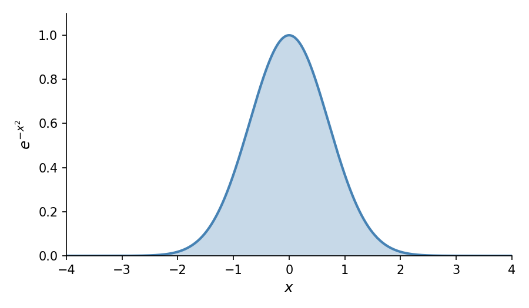

# A Brief Note on the Gaussian Integral

**O. Maclaren**
*March 3, 2026*

## Abstract

We derive the value of the Gaussian integral using polar coordinates.

## The Gaussian Integral

The Gaussian function $f(x) = e^{-x^2}$ plays a central role in probability and statistics.

$$I = \int_{-\infty}^{\infty} e^{-x^2}\,dx = \sqrt{\pi}$$

## Visualisation

Below is a plot of the Gaussian function:

The bell-shaped curve is symmetric about $x = 0$ and decays rapidly as $|x| \to \infty$.

## Conclusion

The Gaussian integral evaluates to $\sqrt{\pi}$, a result with deep connections
to probability theory and physics.
